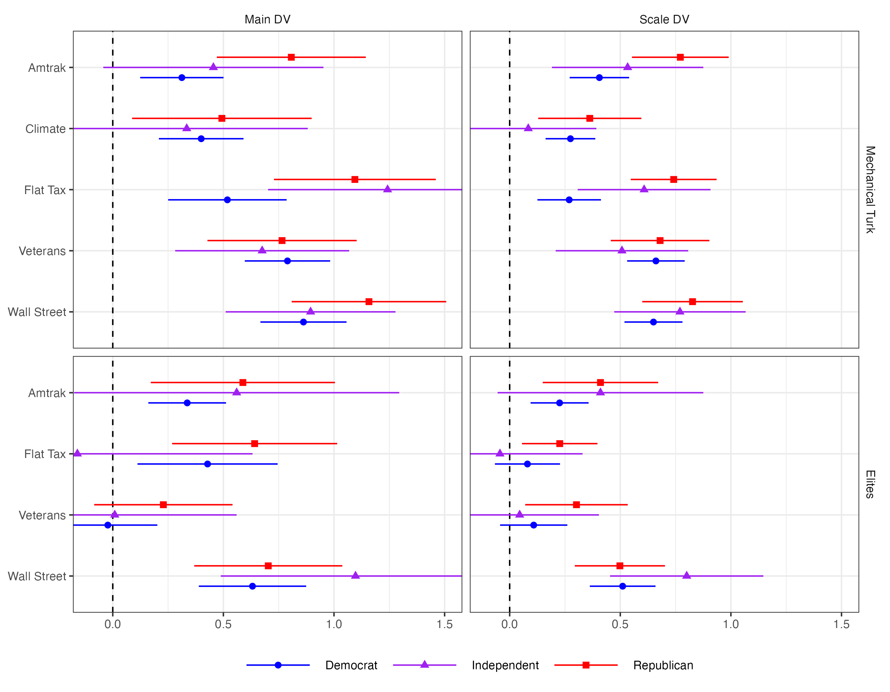
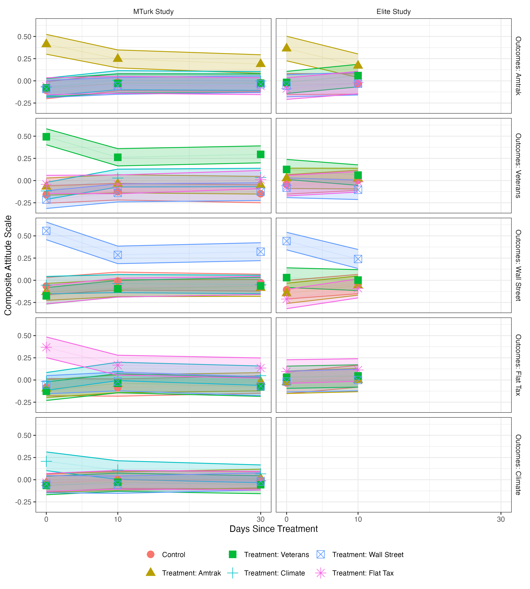

# Active Maintenance Report: coppock_ekins_kirby_2018

2026-08-01

- [Summary](#summary)
  - [Does the deposited archive run?](#does-the-deposited-archive-run)
  - [Does the maintained rewrite reproduce the
    paper?](#does-the-maintained-rewrite-reproduce-the-paper)
- [Paper overview](#paper-overview)
- [Original archive reproducibility](#original-archive-reproducibility)
- [The Table 9 drift](#the-table-9-drift)
- [Errata](#errata)
- [Ground truth summary](#ground-truth-summary)
- [Maintained rewrite](#maintained-rewrite)
- [Figure verification](#figure-verification)
- [Rewrite verification](#rewrite-verification)
- [Checksums](#checksums)
- [R environment](#r-environment)

This repository holds the actively maintained replication code for
Coppock, Ekins and Kirby (2018), together with the reproducibility
report that documents what the original archive did and did not do. It
is part of a program applying the maintenance proposal in Peer, Orr and
Coppock (2021, *PS: Political Science & Politics*, doi
[10.1017/S1049096521000366](https://doi.org/10.1017/S1049096521000366))
to a set of published archives.

|  |  |
|----|----|
| Article | [10.1561/100.00016112](https://doi.org/10.1561/100.00016112) |
| Replication archive | [10.7910/DVN/3KBCJF](https://doi.org/10.7910/DVN/3KBCJF) |
| Pre-analysis plan | [osf.io/rmkw3](https://osf.io/rmkw3) |

**The data are not redistributed here.** The deposit is 1.4 MB across 20
files and lives at Harvard Dataverse, which is the only copy this
repository points at. `download_original.R` fetches it and verifies
every file; `original_manifest.csv` pins the file identifiers, sizes and
checksums, so the exact bytes this code was written against are recorded
in version control even though the bytes themselves are not.

**Repository layout.** `maintained/` is the maintained rewrite: one
script per published table or figure, writing to `output/`, which is
committed so a reader can compare a fresh run against it without
downloading anything. `ground_truth/` ties every published number to the
code that produces it. `original/` is created by the download script and
is deliberately absent from the repository. This file is the
reproducibility report, also available as a PDF in `report/`.

**License.** CC0 1.0 Universal, matching the terms of the deposit this
repository maintains. See `LICENSE`.

**To reproduce.** Clone or download the repository, open
`coppock_ekins_kirby_2018.Rproj`, and run:

``` r
source("run_all.R")
```

That fetches the deposit, verifies its 20 files, and produces every
table and figure into `maintained/output/`. Required packages:
tidyverse, estimatr, lmtest, modelsummary, knitr, kableExtra, here.
Paths resolve through `here`, so nothing depends on the working
directory. The full run takes about thirty seconds. A successful run
overwrites `maintained/output/`, which is committed: **`git diff` on
that folder is the reproduction check.**

# Summary

Two questions, answered before the detail.

## Does the deposited archive run?

Almost. Fifteen of the sixteen deposited R scripts execute without error
on a current R installation. The sixteenth, `opeds_het_fx_analysis.R`,
calls `waldtest()` without ever loading `lmtest`; the package installs
from CRAN and one added `library(lmtest)` line fixes it. Every other
package the archive names is still on CRAN and still works, including
`coefplot`, whose `position_dodgev()` the figure code depends on.

Running is not the same as reproducing, and here the difference is
large. Of the 502 published quantities that can be checked against a
script, 20 no longer reproduce. 17 of those 20 are in Table 9, which has
only eighteen cells. The archive computes those joint F tests as
`waldtest(lm_robust(...), lm_robust(...), test = "F")`. When the archive
was written, `lmtest::waldtest()` had no robust variance to take from an
`lm_robust` object and silently fell back to the classical F test, which
is what the article prints. Current `estimatr` supplies the variance, so
the identical line now returns an HC2 Wald test instead. Every cell of
the table moves. The one cell that still matches to three decimals
(MTurk / Flat Tax / Main DV, 0.009) matches by rounding.

No conclusion in the paper turns on the difference. The two tests the
article calls significant, Amtrak and Flat Tax on MTurk, stay
significant under HC2; the fourteen it calls null stay null.

The remaining 3 failures are not the archive’s fault at all. The
article’s prose reports 3,567 MTurk subjects, 2,169 elite subjects and
1,349 elite Wave 2 responses; its own Tables 1 and 5, the deposited
data, and both the archive and the rewrite give 3,571, 2,181 and 1,358.
Those are typesetting or transcription slips in the text, not analysis
errors, and the tables next to them are right.

## Does the maintained rewrite reproduce the paper?

Yes, on everything the article states. All 499 of the 502 verifiable
ground truth claims match the published values to reported precision,
including the Table 9 p-values, which the rewrite reproduces by
reporting the classical F test alongside the HC2 one rather than by
choosing between them silently. The 3 claims recorded as failures are
the text-versus-table discrepancies above, where the rewrite agrees with
the article’s tables and disagrees with its prose. 4 further quantities
are computed and committed but never printed in the article, so they are
marked unverifiable rather than matched.

# Paper overview

**Citation**: Coppock, A., Ekins, E. and Kirby, D. (2018). “The
long-lasting effects of newspaper op-eds on public opinion.” *Quarterly
Journal of Political Science*, 13(1), 59-87. DOI: 10.1561/100.00016112

**Summary**: Two randomized panel survey experiments estimate the
persuasive effect of real newspaper opinion pieces on policy attitudes.
One runs on Amazon Mechanical Turk (N = 3,571), the other on a
convenience sample of political and policy elites (N = 2,181) recruited
from a list of 32,498 email addresses. Subjects were assigned to read
one of five op-eds, on Amtrak, climate change, the flat tax, veterans’
health care and Wall Street regulation, or to a control condition that
read nothing; the elite study dropped the climate arm for want of
sample. Outcomes were measured immediately, ten days later, and, on
MTurk only, thirty days later. The op-eds moved attitudes on their
target issues by roughly 0.4 to 0.9 points on seven-point scales and 0.3
to 0.7 standard deviations on composite scales, moved attitudes on
non-target issues essentially not at all, produced effects that were
still visible thirty days later, and produced smaller effects among
elites than among the mass public.

# Original archive reproducibility

The deposit is twenty files: three `.RData` data files, sixteen R
scripts and a README.

| Script | Produces | Status |
|:---|:---|:---|
| opeds_source.R | Helper functions, sourced by every other script | Clean |
| opeds_recontact_rates.R | Tables 1 and 5, plus the recontact rates on pp. 66 and 72 | Clean |
| opeds_main_analysis.R | Tables 3, 4, 6 and 7 | Clean |
| opeds_compare_samples.R | Table 8 | Clean |
| opeds_het_fx_analysis.R | Figure 1, Table 9, and the by-party averages on p. 77 | Errors: waldtest() called without library(lmtest) |
| opeds_persistence.R | Figure 2 | Clean |
| opeds_agreement.R | Table 11 | Clean |
| opeds_compliance.R | Reading-time claims on pp. 69 and 72 | Clean |
| opeds_monkey.R | A presentation figure that is in neither the article nor the appendix | Clean |
| opeds_het_fx_age_analysis.R | Figure I.10 (appendix) | Clean |
| opeds_persistence_pid.R | Figure H.9 (appendix) | Clean |
| opeds_appendix_attrition.R | Tables D.4 to D.7 (appendix) | Clean |
| opeds_appendix_demographics.R | Tables B.1 to B.3 and Figure B.6 (appendix) | Clean |
| opeds_appendix_distractor.R | Figure C.8 (appendix) | Clean |
| opeds_appendix_heatmaps.R | Figures A.1 to A.5 (appendix) | Clean |
| opeds_appendix_mj.R | Figure C.7 (appendix) | Clean |

Deposited scripts and their status under R 4.6.0.

Four things are worth recording beyond the single error.

**The one error.** `opeds_het_fx_analysis.R` loads `tidyverse`,
`estimatr`, `coefplot` and `reshape2`, then calls `waldtest()` at lines
171 and 200. `waldtest()` belongs to `lmtest`, which is never loaded.
The script builds Figure 1 and prints the by-party averages before it
dies, so the failure is at the F tests only. Adding `library(lmtest)` is
the whole fix.

**The archive’s own README undercounts itself.** It states that the
archive “has 15 scripts” and lists fifteen. The deposit contains sixteen
R files. `opeds_monkey.R` appears in neither the list nor the count; it
draws a bar chart of the percentage agreeing with each op-ed author that
appears in no part of the published article or appendix.

**The archive writes into itself.** Every script begins with
`rm(list = ls())` and a comment instructing the user to set the working
directory to the archive folder. Running them there leaves an
`Rplots.pdf` behind, which is how the copy of this deposit that seeded
this repository came to contain a file the deposit does not. All twenty
deposited files verify byte for byte against Dataverse; the stray plot
file has been removed, so `original/` now holds the deposit and nothing
else.

**Table 7’s significance stars are wrong in the archive.** The three
other `stargazer()` calls in `opeds_main_analysis.R` pass
`p = starprep(..., stat = "p.value")`. The fourth, the one that makes
Table 7, omits `stat = "p.value"`, so `stargazer` receives standard
errors where it expects p-values and marks every coefficient in the
table with a single star. The published Table 7 carries the correct
stars, so the version that reached print was not the version the deposit
reproduces. Estimates and standard errors are unaffected, and the
rewrite’s `modelsummary` tables take stars from p-values.

# The Table 9 drift

This is the substantive reproducibility finding, and it is worth stating
in full because the mechanism is invisible from the code.

`opeds_het_fx_analysis.R` tests whether treatment effects differ across
Democrats, Independents and Republicans by comparing
`dv ~ Z + pid_3_cat` against `dv ~ Z * pid_3_cat`:

``` r
fit_r <- lm_robust(local_formula_r, data = local_df)
fit_u <- lm_robust(local_formula_u, data = local_df)
anova_fit <- waldtest(fit_r, fit_u, test = "F")
```

`lmtest::waldtest()` looks for a `vcov` method on the objects it is
given. Older `estimatr` did not export one for `lm_robust`, so
`waldtest()` fell through to the classical variance implied by the
residuals, and the p-values the article prints are classical F tests.
Current `estimatr` does export it, so the same three lines now produce
an HC2 Wald test. The author’s evident intent, visible in the choice of
`lm_robust`, was the robust test; the published numbers are the
classical one.

| Sample | Issue       | DV       | Published | Classical F | HC2 Wald |
|:-------|:------------|:---------|:----------|:------------|:---------|
| MTurk  | Amtrak      | Main DV  | 0.045     | 0.045       | 0.042    |
| MTurk  | Amtrak      | Scale DV | 0.029     | 0.029       | 0.020    |
| MTurk  | Climate     | Main DV  | 0.845     | 0.845       | 0.883    |
| MTurk  | Climate     | Scale DV | 0.243     | 0.243       | 0.362    |
| MTurk  | Flat Tax    | Main DV  | 0.009     | 0.009       | 0.009    |
| MTurk  | Flat Tax    | Scale DV | 0.001     | 0.001       | 0.000    |
| MTurk  | Veterans    | Main DV  | 0.878     | 0.878       | 0.876    |
| MTurk  | Veterans    | Scale DV | 0.562     | 0.562       | 0.615    |
| MTurk  | Wall Street | Main DV  | 0.310     | 0.310       | 0.341    |
| MTurk  | Wall Street | Scale DV | 0.371     | 0.371       | 0.374    |
| Elite  | Amtrak      | Main DV  | 0.436     | 0.436       | 0.487    |
| Elite  | Amtrak      | Scale DV | 0.342     | 0.342       | 0.383    |
| Elite  | Flat Tax    | Main DV  | 0.146     | 0.146       | 0.187    |
| Elite  | Flat Tax    | Scale DV | 0.293     | 0.293       | 0.284    |
| Elite  | Veterans    | Main DV  | 0.434     | 0.434       | 0.431    |
| Elite  | Veterans    | Scale DV | 0.291     | 0.291       | 0.320    |
| Elite  | Wall Street | Main DV  | 0.316     | 0.316       | 0.372    |
| Elite  | Wall Street | Scale DV | 0.265     | 0.265       | 0.283    |

Table 9 as published, as the rewrite reproduces it, and as the archive’s
own code now returns it.

The rewrite computes both and writes both to
`maintained/output/table_9_het_fx_ftests.csv`. The `.tex` table it
renders uses the classical column, because that is the published table.
`party_ftest()` in `helpers.R` takes `se_type` as a required argument
for the same reason: an analysis choice this consequential should not
sit in a default.

# Errata

None. The rewrite changes no analytical decision. The three ground truth
rows recorded as `match_rewrite = 0` are places where the article’s
prose disagrees with the article’s own tables, listed below, and no
correction to the code would resolve them.

| Claim | In the text | In the data | Note |
|:---|---:|---:|:---|
| MTurk subjects enrolled (p. 66) | 3567 | 3571 | Article says 3,567; Table 1 and the data both give 3,571. Text typo, off by 4. |
| Elite subjects who completed the survey (p. 72) | 2169 | 2181 | Article says 2,169; Table 5 and the data both give 2,181. Same class of text typo as the MTurk count. |
| Elite complete responses in Wave 2 (p. 72) | 1349 | 1358 | Article says 1,349; Table 5 and the data both give 1,358. |

Text-versus-table discrepancies in the published article.

The MTurk discrepancy was already known; the two elite ones are new. All
three run the same way: the prose undercounts, the table is right, and
the analyses use the table’s number.

# Ground truth summary

`ground_truth/coppock_ekins_kirby_2018_ground_truth.csv` records 506
published quantities. `value_paper` was read from the article PDF and
from nowhere else. `value_script` is what the deposited scripts return
today; `value_rewrite` is what `maintained/output/` contains.

| Table or claim | Claims | Archive matches | Archive fails | Rewrite matches | Rewrite fails | Unverifiable |
|:---|---:|---:|---:|---:|---:|---:|
| table_1 | 49 | 49 | 0 | 49 | 0 | 0 |
| table_3 | 70 | 70 | 0 | 70 | 0 | 0 |
| table_4 | 70 | 70 | 0 | 70 | 0 | 0 |
| table_5 | 30 | 30 | 0 | 30 | 0 | 0 |
| table_6 | 48 | 48 | 0 | 48 | 0 | 0 |
| table_7 | 48 | 48 | 0 | 48 | 0 | 0 |
| table_8 | 88 | 88 | 0 | 88 | 0 | 0 |
| table_9 | 18 | 1 | 17 | 18 | 0 | 0 |
| table_11 | 66 | 66 | 0 | 66 | 0 | 0 |
| text | 19 | 12 | 3 | 12 | 3 | 4 |

Ground truth coverage by published table.

Coverage is every estimate, standard error, constant, R-squared and N
printed in Tables 1, 3, 4, 5, 6, 7, 8, 9 and 11, plus the in-text
quantities on pp. 66, 69, 72 and 77. Table 2 lists the op-eds and Table
10 is a hand-assembled circulation table built from figures the archive
does not contain, so neither is reproducible from the deposit and
neither is claimed here. Figures 1 and 2 print no numbers; their
underlying estimates are written to CSV so they can be diffed, but there
is nothing in them to check against the page.

# Maintained rewrite

Eleven scripts and a `helpers.R`, one per published float, plus three
for the in-text quantities.

| Script | Produces |
|:---|:---|
| helpers.R | Packages, deposited data, shared labels and three shared estimators |
| table_1_5_design.R | Tables 1 and 5 |
| table_3_4_mturk_effects.R | Tables 3 and 4 |
| table_6_7_elite_effects.R | Tables 6 and 7 |
| table_8_compare_samples.R | Table 8 |
| table_9_het_fx_ftests.R | Table 9, both F tests |
| table_11_agreement.R | Table 11 and its precision-weighted averages |
| figure_1_het_fx_by_party.R | Figure 1 and the by-party estimates behind it |
| figure_2_persistence.R | Figure 2 and the group means behind it |
| text_recontact_rates.R | Enrolment, recontact and chi-square claims, pp. 66 and 72 |
| text_partisan_pw_averages.R | By-party averages and the Republican-Democrat difference, p. 77 |
| text_reading_time.R | Reading-time claims, pp. 69 and 72 |

Scripts in maintained/.

**Substitutions.** `stargazer` plus `sink()` becomes
`modelsummary(output = ...)`, which writes straight to a file and takes
its stars from p-values. `reshape2::melt()` and `dcast()` become
`pivot_longer()` and `pivot_wider()`. `coefplot::position_dodgev()` and
`geom_errorbarh()` become `position_dodge()` and `geom_linerange()`,
since ggplot2 4.x dodges along a discrete y axis without help.
`do(tidy(...))` becomes `reframe(tidy(...))`. `lm()` plus
`estimatr::starprep()` becomes `lm_robust(se_type = "HC2")`, which is
the same variance estimator reached directly. `xtable` is left behind
rather than replaced, because the tables it built are hand-assembled and
`knitr::kable` plus `kableExtra` renders them straight into this report.
No seeds are set anywhere in the archive and none are needed: nothing
here samples.

**Nothing typed in.** The archive’s `opeds_compliance.R` ends with two
bare subtractions, `160.4120 - 134.00352` and `232.0353 - 186.43233`,
whose inputs were copied from a previous run of the same script. The
rewrite computes those differences from the data. They come to 26.41 and
45.60 seconds, which is where the article’s “25-45 seconds less” comes
from.

**A finding that fell out of computing it.** The article says the elite
sample “spent 25-45 seconds less time reading our treatment articles
than the MTurk sample.” Computed across all four arms the two samples
share, rather than the two the archive typed in, the differences are:

| Op-ed       | MTurk (s) | Elite (s) | Difference (s) |
|:------------|:----------|:----------|:---------------|
| Amtrak      | 160.4     | 134.0     | 26.4           |
| Flat Tax    | 232.0     | 186.4     | 45.6           |
| Veterans    | 176.6     | 207.3     | -30.7          |
| Wall Street | 108.9     | 80.4      | 28.5           |

Trimmed mean reading time by arm, MTurk minus elite.

Three arms fall in or near the stated range. On the veterans op-ed the
elite sample spent thirty-one seconds more, not less. The claim as
written holds for three of four op-eds.

**A defect in the March 2026 rewrite, fixed here.** The first pass at
`table_11_agreement.R` passed the treatment arm to its fitting function
from inside a `mutate()`, where the bare name `arm` resolves to the
whole column rather than the current row. Every model was therefore fit
on all six arms at once. The script produced 41 rows where the published
table has 27, labelled them with repeating topic names, and computed
precision-weighted averages of 0.05 and 0.03 where the article reports
0.20 and 0.12. Nothing in the pipeline caught it, because the March
ground truth had no rows for Table 11. It has 66 now.

# Figure verification

Neither published figure prints a number, so verification is visual
against the article plus a numeric diff of the estimates behind each
panel.



Figure 1, effects of treatment by party and experimental sample. The
rewrite reorders the issue axis so the panels read top to bottom in the
article’s order and drops `coord_flip()`, which the current ggplot2 does
not need.



Figure 2, long-term effects of treatment. The archive plots the wave
index against an axis relabelled 0, 10 and 30 days, which compresses the
ten-day gap and the twenty-day gap to the same width. The rewrite plots
the actual day counts.

# Rewrite verification

Every script was run twice from a clean session and the outputs diffed.
All twenty-eight CSV, TeX and PNG files are byte-identical between runs;
the two PDF figures differ only in the creation timestamp a PDF records
internally. Nothing in the rewrite samples, so no seed is involved in
that result.

`run_all.R` was run end to end immediately before this report was
rendered, so the committed `maintained/output/` is the product of a
single ordered run rather than of scripts executed one at a time. The
order matters in one place: `text_partisan_pw_averages.R` averages the
estimates `figure_1_het_fx_by_party.R` writes, so it runs after it.

# Checksums

All twenty deposited files were fetched from Dataverse with
`?format=original` and hashed. The MD5 of what Dataverse serves agrees
with the MD5 Dataverse publishes for all twenty, including
`elite_opeds_cleaned.RData` and `mturk_opeds_cleaned.RData`, which
Dataverse ingested to tabular `.tab` files: the published checksums
describe the deposited RData, not the derived table. The local copy that
seeded this repository is byte-identical to what the server returns, so
nothing in it drifted in the eight years since deposit.

# R environment

| Component    | Version |
|:-------------|:--------|
| R            | 4.6.0   |
| tidyverse    | 2.0.0   |
| estimatr     | 1.0.6   |
| lmtest       | 0.9.40  |
| modelsummary | 2.6.0   |
| knitr        | 1.51    |
| kableExtra   | 1.4.0   |
| here         | 1.0.2   |

Environment this report was rendered in.

The archive’s own README names no R version. The packages it names are
`coefplot`, `dplyr`, `estimatr`, `MASS`, `nnet`, `reshape2`,
`stargazer`, `tidyverse` and `xtable`; `lmtest` is used but not named,
which is the archive’s one error.
